<div align="center">


<br/>

[](https://github.com/Alexoswin)
&nbsp;
[](https://github.com/Alexoswin)
&nbsp;
[](https://linkedin.com/in/oswin-alex)
&nbsp;
[](https://oswinalex.site)

<br/>



</div>

## `whoami`

```ts
const oswin = {
  location   : "Mumbai, India 🇮🇳",
  focus      : ["Agentic AI", "Real-Time Systems", "Scalable Backends"],
  stack      : {
    frontend : ["React", "Next.js", "Tailwind CSS"],
    backend  : ["NestJS", "Node.js", "Express"],
    db       : ["MongoDB", "MySQL"],
    infra    : ["AWS", "Docker", "Jenkins"],
  },
  openSource : "Frappe Framework Contributor — OAuth2 RFC fix, merged ✅",
  awards     : ["🏆 Smart India Hackathon Winner", "🏆 Innovex 2025 Winner"],
};
```

## Tech Stack

<div align="center">


</div>

## 3D Contribution Graph

<div align="center">


</div>

## Contribution Snake

<div align="center">


</div>

## Featured Projects

<div align="center">

<table>
<tr>
<td>
<a href="https://github.com/Alexoswin/deepfake_detection">

</a>
</td>
<td>
<a href="https://github.com/Alexoswin/smart-blind-stick">

</a>
</td>
</tr>
<tr>
<td>
<a href="https://github.com/Alexoswin/email-spam-classifier">

</a>
</td>
<td>
<a href="https://github.com/Alexoswin/portfolio-website">

</a>
</td>
</tr>
</table>

</div>

## GitHub Stats

<div align="center">


&nbsp;


<br/><br/>


<br/><br/>


</div>

## Trophies

<div align="center">


</div>

<div align="center">


</div>
